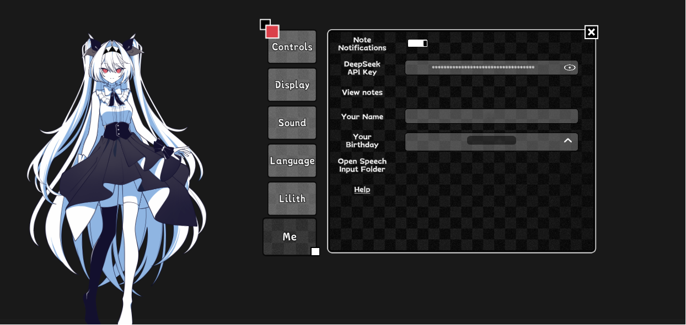

# LilithMod

A companion mod for *The NOexistenceN of Lilith* that gives Lilith an LLM-powered
brain, voice synthesis, and speech recognition — all running locally on your machine.

## What she can do

- **Talk to her** — press F7 to type, F8 to speak. She answers in text and voice.
- **Any LLM backend** — DeepSeek, OpenAI, Anthropic, OpenRouter, Groq, Gemini, or
  local servers (Ollama, LM Studio, llama.cpp, vLLM). Configure in one file.
- **Her own voice** — local GPT-SoVITS synthesis. Train her on any voice you want.
- **Remembers you** — episodic memory across sessions, notes, and context awareness
  of time, music, and what you're doing.
- **Multilingual** — speaks and reads subtitles in English, Japanese, or Chinese.

## Install

Download `LilithMod-Setup-1.0.6.0.exe` from
[Releases](https://github.com/pat58151/LilithMod/releases), close the game, run it.
The installer puts BepInEx and the mod in place. Settings and personal data are
preserved when upgrading.

You'll need an API key (DeepSeek is the default) or a local model server. See
[SETUP.md](SETUP.md) for the full walkthrough — API key, voice, speech input,
and auto-start.

## Requirements

- Windows 10 or later
- *The NOexistenceN of Lilith* (Steam)
- An API key for a hosted LLM, or a local OpenAI-compatible server
- A GPU is recommended for voice synthesis but not required

## License

LilithMod is MIT-licensed. The game, its characters, and assets belong to their
respective rights holders. See [DISCLAIMER.md](DISCLAIMER.md).
