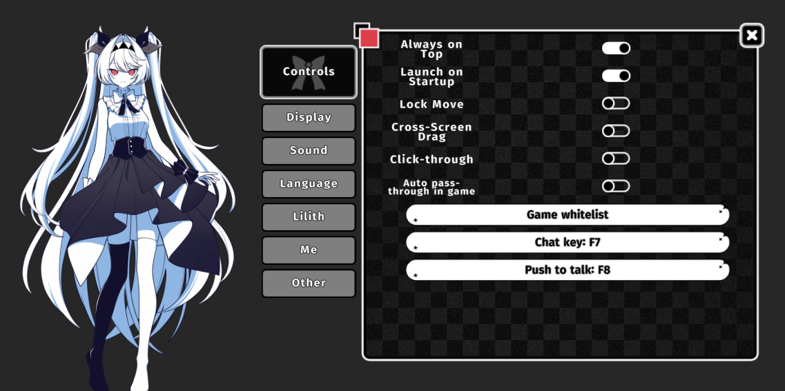

# LilithMod

An unofficial mod for *The NOexistenceN of Lilith*. It lets you talk to Lilith
by text or voice. She answers in character, remembers past conversations,
reacts to what you do, and sometimes speaks first.

[Report a bug or ask for help](https://github.com/pat58151/LilithMod/issues/new)

> Fan-made. Not affiliated with or endorsed by the game's developers or
> publishers. See the [Disclaimer](DISCLAIMER.md).

## Talking to her

- **Chat.** Press F7 and type. Subtitles follow your game language.
- **Speech input.** Press F8 and speak. Speech recognition runs on your PC.
  Microphone audio is not uploaded.
- **Wake word.** Say her name and she starts listening. No key needed.
- **Languages.** English, Japanese, or Chinese. You can switch mid-conversation.

## Her voice

- She can speak her replies while subtitles show in game.
- No voice is bundled. You choose or train the voice she uses.
- The game's original voice stays available.
- Cached game lines still play while the voice server is starting or down.
  Uncached lines show subtitles only.

Voice is optional. Text chat works without it.

## Memory

- She remembers recent conversations.
- Important moments are saved as long-term memories and can come back later.
- A memory made in one language can be recalled in another.
- Memory is stored on your PC.

## What she notices

- Time of day
- Whether she is active, resting, or asleep
- Your touches and other interactions
- The name of the game or app in the foreground
- Music you play through the game

She reads only the foreground app's name. She does not read window contents,
documents, messages, or web pages.

## Other features

- **Speaking first.** She sometimes starts a conversation. The line is written
  for the moment, not picked from a list.
- **Notes.** After enough time together she may leave a note in the in-game
  inbox.
- **Music.** She knows which track you picked from the music folder. The mod
  adds a separate music volume control.
- **Weather.** Ask and she looks up current conditions.
- **Web search.** She can look things up through public SearXNG servers or your
  own.
- **Opacity.** Make her more see-through so she does not block your screen.

## Privacy

Voice recognition, memory, notes, and custom voice files stay on your PC.

Your chat goes to the AI service you set up, using your own API key. Use a
local AI and the chat stays on your PC too. The full list of what is sent is in
[What she sends out](SETUP.md#what-she-sends-out).

## Requirements

- *The NOexistenceN of Lilith* v1.0.11
- Windows
- An API key for an AI service, or a local AI

Voice output, speech input, and the wake word are optional.

## Install

1. Download the latest `LilithMod-Setup-<version>.exe` from
   [Releases](https://github.com/pat58151/LilithMod/releases).
2. Run it and select your game folder. Tick the boxes if you want the voice and
   speech input parts.
3. Start the game through Steam.

The mod only adds its own files. Uninstalling returns the game to normal.

Next, follow the [Setup guide](SETUP.md) to connect an AI and set up her voice.

## Docs

- [Setup](SETUP.md): AI service, voice, speech input, troubleshooting.
- [Design techniques](TECHNIQUES.md): how the systems work.
- [Disclaimer](DISCLAIMER.md): what this project is and is not.
- [License](LICENSE): MIT, code only. Game assets and voice models you add are
  not covered.
